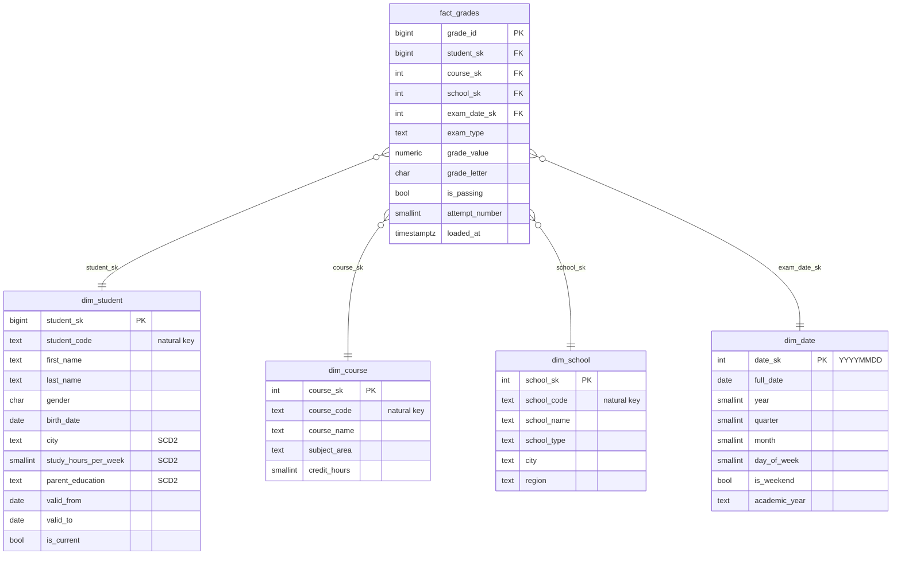

# Student Performance Warehouse

> Star-schema PostgreSQL warehouse for student-performance data with **SCD Type 2** student tracking, an idempotent Python loader, analytical views, and a Metabase dashboard. `docker compose up` spins up the whole stack.

[](https://github.com/wxssxm/student-performance-warehouse/actions/workflows/ci.yml)
[](https://www.python.org/)
[](https://www.postgresql.org/)
[](LICENSE)
[](docker-compose.yml)

A small but complete Kimball-flavoured warehouse: 1 fact table, 4 dimensions (one of them SCD Type 2), an idempotent Python loader, seven analytical views, and a `docker compose` stack that brings up Postgres + the loader + Metabase.

## Star schema



## Stack

| Layer | Technology |
| --- | --- |
| Database | PostgreSQL 16 + `btree_gist` extension |
| Loader | Python 3.11+ with [psycopg 3](https://www.psycopg.org/psycopg3/) |
| Config | [pydantic-settings](https://docs.pydantic.dev/latest/concepts/pydantic_settings/) |
| Logging | [loguru](https://loguru.readthedocs.io) |
| CLI | [Typer](https://typer.tiangolo.com) + [Rich](https://rich.readthedocs.io) |
| BI | [Metabase 0.51](https://www.metabase.com) (provisioned via API) |
| Tests | pytest (unit + Postgres-backed integration) |
| Lint | ruff + black |
| CI / packaging | GitHub Actions (Postgres service), Docker multi-stage, [uv](https://docs.astral.sh/uv/) |

## Quickstart

```bash
git clone https://github.com/wxssxm/student-performance-warehouse.git
cd student-performance-warehouse
cp .env.example .env

# Spin up postgres + loader + metabase. Loader auto-applies DDL,
# seeds dim_date for 2024-2026, then loads CSVs.
make docker-up

# Open Metabase, create the admin account at http://localhost:3000,
# then provision the datasource:
make metabase

# Tear down
make docker-down
```

The `loader` service runs `student-warehouse load-all` on container start, which is idempotent — `docker compose up` a second time is a no-op for already-loaded rows.

### Local development without Docker

```bash
docker run --rm -d --name pg -p 5432:5432 \
  -e POSTGRES_USER=warehouse -e POSTGRES_PASSWORD=warehouse_dev_only -e POSTGRES_DB=student_warehouse \
  postgres:16-alpine

make install
make load-all     # apply DDL + seed dim_date + load CSVs
make test         # 24 tests (18 unit + 6 PG integration)
```

## SCD Type 2 in 30 seconds

`dim_student` keeps a full version history of three tracked attributes — `city`, `study_hours_per_week`, `parent_education`. On every reload of a snapshot CSV, the loader does the following per natural key:

1. Read the current row (`is_current = TRUE`).
2. If no current row → insert a fresh version with `valid_from = snapshot_date`.
3. If the tracked attributes match → no-op.
4. If they differ → close the current row (`valid_to = snapshot_date`, `is_current = FALSE`) and insert a new version with `valid_from = snapshot_date`.

A `daterange` exclusion constraint guarantees there is **at most one row per (student_code, point in time)** — the database itself enforces SCD2 correctness, not the loader. `fact_grades` then joins the version valid at `exam_date`, so a student who moved to a new city in February still has January exams attributed to their pre-move profile.

```sql
-- Verify "exactly one current row per natural key"
SELECT student_code, COUNT(*) FILTER (WHERE is_current)
FROM warehouse.dim_student
GROUP BY student_code
HAVING COUNT(*) FILTER (WHERE is_current) <> 1;
-- Expected: zero rows
```

## CLI

```bash
student-warehouse --help                         # discover commands
student-warehouse apply-ddl                      # drop + recreate the schemas
student-warehouse seed-dim-date --start 2010 --end 2030
student-warehouse load                           # load every CSV in $SEED_DIR
student-warehouse load-students data/sample/students_v2.csv  # SCD2 a single CSV
student-warehouse load-all                       # one-shot bootstrap
```

## Analytical views

Seven views in `sql/analytics/views.sql`, all ready for Metabase questions:

| View | What it answers |
| --- | --- |
| `v_avg_grade_by_school` | Mean grade + pass-rate by school, ranked |
| `v_grade_by_subject_area` | Mean + stddev of grades per subject |
| `v_top_students` | Top 20 current students with ≥ 3 exams |
| `v_gender_gap` | Mean grade by `(subject_area, gender)` |
| `v_study_hours_impact` | Mean grade bucketed by study-hours-per-week |
| `v_grade_trend_by_month` | Monthly mean grade timeseries |
| `v_scd2_audit` | Students with > 1 dimension version (history) |

Sample query against `v_top_students`:

```sql
SELECT * FROM warehouse.v_top_students LIMIT 10;
```

## Data dictionary

### `fact_grades`

| Column | Type | Notes |
| --- | --- | --- |
| `grade_id` | `BIGINT` PK | Natural key from source |
| `student_sk` | `BIGINT` FK | Points at the dim_student version valid at `exam_date` |
| `course_sk` | `INTEGER` FK | |
| `school_sk` | `INTEGER` FK | |
| `exam_date_sk` | `INTEGER` FK | `YYYYMMDD` |
| `exam_type` | `TEXT` | `quiz | midterm | final` |
| `grade_value` | `NUMERIC(4,1)` | 0.0–20.0 (French scale) |
| `grade_letter` | `CHAR(1)` | Derived: A ≥ 16, B ≥ 14, C ≥ 12, D ≥ 10, F < 10 |
| `is_passing` | `BOOLEAN` | `grade_value >= 10` |
| `attempt_number` | `SMALLINT` | 1 for first attempt, 2 for retake |
| `loaded_at` | `TIMESTAMPTZ` | Audit timestamp |

### `dim_student` (SCD Type 2)

| Column | Type | Notes |
| --- | --- | --- |
| `student_sk` | `BIGINT` PK (surrogate) | One per version |
| `student_code` | `TEXT` | Natural key (e.g. `STU0042`) |
| `first_name`, `last_name`, `gender`, `birth_date` | — | Type 0 — fixed at first insert |
| `city`, `study_hours_per_week`, `parent_education` | — | **Tracked** — change creates a new version |
| `valid_from` | `DATE` | First day this version was valid |
| `valid_to` | `DATE` | Day after the version was closed (`9999-12-31` for current) |
| `is_current` | `BOOLEAN` | Convenience flag (= `valid_to = '9999-12-31'`) |

## Testing

```bash
make test               # 24 tests with coverage gate at 70%
uv run pytest -m "not integration"   # 18 unit tests, no DB
```

| Suite | Count | What it covers |
| --- | --: | --- |
| Unit | 18 | `_grade_letter` boundaries, `_build_dim_date_row` (academic year, weekend, date_sk), config DSN |
| Integration | 6 | Full `load_all`, SCD2 invariant, idempotence of every loader function, analytics views are queryable |

CI runs both suites against a Postgres service container; integration tests exercise the bulk of `loader.py`, pushing total coverage well above the 70% gate.

## Reliability touches

- **Idempotent at every layer**: DDL `DROP IF EXISTS` + `CREATE`, dim loaders `ON CONFLICT DO UPDATE`, fact loader `ON CONFLICT DO NOTHING`, dim_date `ON CONFLICT (date_sk) DO NOTHING`.
- **Database-enforced SCD2 invariant** via `EXCLUDE USING gist (... daterange ...)` — no overlapping versions are physically possible.
- **Point-in-time fact join** — `fact_grades` joins to the dim_student version where `exam_date BETWEEN valid_from AND valid_to`.
- **CHECK constraints** on `school_type`, `gender`, `exam_type`, `grade_value`, `attempt_number` — bad data fails fast at insert time, not silently in queries.

## Roadmap

- [ ] `point_in_time` view that pre-computes the SCD2 join (saves Metabase users from doing it)
- [ ] Migrate DDL to Alembic so schema changes have a history
- [ ] Add a `dim_term` (academic period) for clearer cohort analytics
- [ ] Bundle a Metabase dashboard JSON export so the BI panels are auto-provisioned
- [ ] Backfill mode that ignores `valid_to` and rewrites history (for reloading from a corrected source)

## License

MIT — see [LICENSE](LICENSE).

## Author

**Wassim Fayala** — Data Engineer apprenti @ La Forge (Paris)

[LinkedIn](https://www.linkedin.com/in/wassim-fayala/) · wassimfayala2@gmail.com
